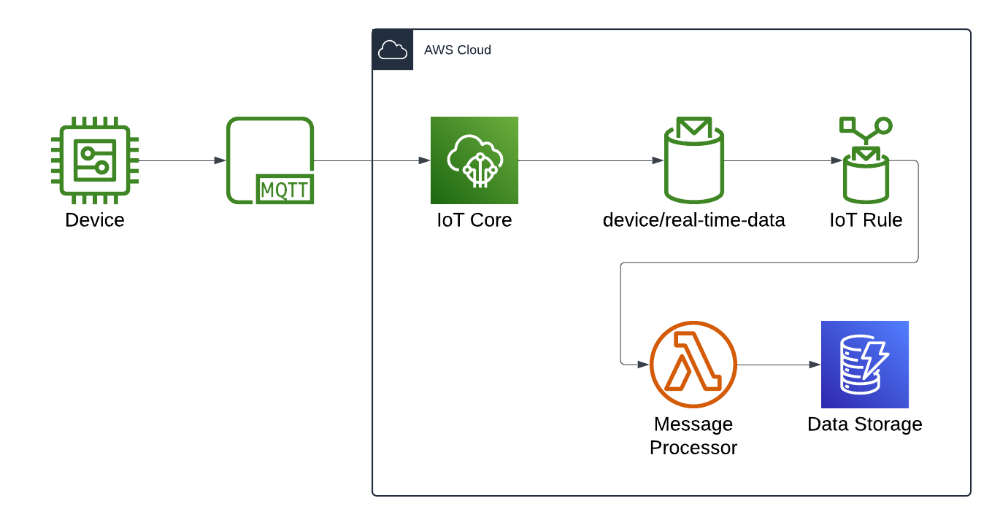

# Cost Modeling Notebook

This project contains an example Jupyter notebook that demonstrates how to use the AWS SDK for Python (Boto3) and
Pola.rs to model the cost of running a workload on AWS.



## Getting Started

This section provides some guides on how to stand up your development environment.

### Install

This project is written in Python and requires that it be installed prior to development. There are many ways to manage
Python installations on your system. We recommend using [pyenv](https://github.com/pyenv/pyenv) or
[mise-en-place](https://mise.jdx.dev/) to manage Python versions in your environment. The current version of Python
used by the project can be found in the `.python-version` file.

### Poetry

This project uses [Poetry](https://python-poetry.org/) to manage dependencies and virtual environments. To install
Poetry run the following command:

```bash
curl -sSL https://install.python-poetry.org | python3 -
```

Once Poetry is installed, you can install the project dependencies by running the following command:

```bash
poetry install
```

## Additional Resources

- [AWS SDK for Python](https://boto3.amazonaws.com/v1/documentation/api/latest/index.html)
- [Azure Retail Pricing](https://learn.microsoft.com/en-us/rest/api/cost-management/retail-prices/azure-retail-prices)
- [Pandas](https://pandas.pydata.org/)
